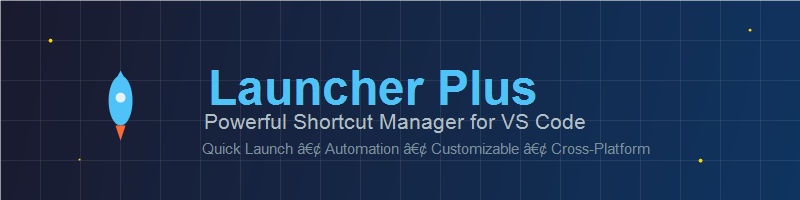
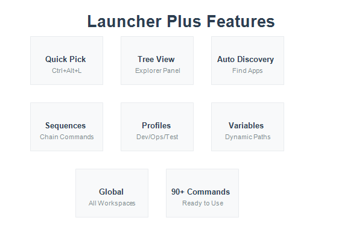

# Launcher Plus (Shortcuts)

<div align="center">



[](https://github.com/PutraAdiJaya/any-launcher-plus)
[](LICENSE)
[](https://github.com/PutraAdiJaya/any-launcher-plus/releases)
[](https://github.com/PutraAdiJaya/any-launcher-plus)

**Launch applications, run scripts, and open documents directly from your editor with customizable shortcuts and automation workflows.**

[🚀 Quick Start](#-installation) • [✨ Features](#-features) • [⚙️ Configuration](#️-configuration) • [📚 Examples](#-examples) • [🤝 Contributing](#-contributing)

</div>

---

## ✨ Features

<div align="center">

| 🚀 **Core Features** | ⚡ **Advanced Features** | 🛠️ **Developer Tools** |
|:---:|:---:|:---:|
| Tree View Panel | Sequence Execution | Auto-Discovery |
| Quick Pick (`Ctrl+Alt+L`) | Profile Management | Import/Export |
| Context Variables | Visual Editor | Task Generation |
| Default App Handler | Recent Items | Smart Validation |

</div>

### 🎯 Core Capabilities

- **🌳 Tree View Panel** - Organized shortcuts in Explorer sidebar with intuitive navigation
- **⚡ Quick Pick** - Lightning-fast command palette integration (`Ctrl+Alt+L`)
- **🔧 Context Variables** - Dynamic path resolution with `${file}`, `${workspaceFolder}`, `${relativeFile}`, `${lineNumber}`, `${selectedText}`
- **📂 Default App Handler** - Open files with OS default applications seamlessly
- **🕐 Recent Items** - Track and quickly access recently used shortcuts
- **🎨 Custom Icons** - Use VS Code codicons or custom images for visual appeal

### 🚀 Advanced Features

<div align="center">



</div>

- **🔄 Sequence Execution** - Chain multiple commands (serial or parallel execution)
- **👥 Profile Management** - Filter shortcuts by active profile (dev, ops, testing, etc.)
- **🔍 Auto-Discovery** - Automatically detect installed apps (Chrome, Office, Git Bash, WSL)
- **📤 Import/Export** - Share configurations across workspaces and teams
- **⚙️ Task Generation** - Convert shortcuts to VS Code tasks for build integration
- **✏️ Visual Editor** - Edit shortcuts with built-in webview editor interface

### 🎉 What's New in v0.1.0

<div align="center">

```
🌍 Global Shortcuts    🎉 Auto-Initialization    🔄 Auto-Recovery
�️ Smarot Cooldowns     📊 Loading Indicators     🔍 Smart Validation
� Auto-Fix  Engine     🚫 Duplicate Prevention   🔐 SSH Templates
⚡ Build Commands      🎯 90+ Ready Commands     🚀 Enhanced UX
```

</div>

**🌟 Major Enhancements:**

- **🌍 Global Shortcuts** - Define shortcuts once, use everywhere across all workspaces
- **🎉 Auto-Initialization** - Default shortcuts auto-created on first install with 90+ ready-to-use commands
- **🔄 Auto-Recovery** - Deleted shortcuts file? No problem! Automatically restored from template
- **🛡️ Double-Click Prevention** - Smart 300ms cooldown prevents accidental multiple executions
- **📊 Loading Indicators** - Real-time visual feedback with status bar messages
- **🔍 Smart Validation** - Automatic program path verification with detailed reports
- **🔧 Auto-Fix Engine** - Intelligent detection and fixing of invalid program paths
- **🚫 Duplicate Prevention** - Advanced deduplication by ID ensures clean shortcut list
- **🔐 SSH Shortcuts** - Built-in SSH/SCP templates for localhost and remote connections
- **⚡ Build Commands** - Pre-configured shortcuts for npm, go, cargo, docker, maven, gradle, dotnet, make

### Cross-Platform Support

- ✅ Windows
- ✅ macOS  
- ✅ Linux
- ✅ Compatible with VS Code, Cursor, Windsurf, and other VS Code variants

---

## 📦 Installation

<div align="center">

### 🚀 Quick Install Options

| Method | Status | Instructions |
|:---:|:---:|:---|
| **🎯 VSIX** | ✅ **Recommended** | Download `.vsix` → Install from VSIX |
| **🏪 Marketplace** | 🔄 Coming Soon | Search "Launcher Plus" in Extensions |
| **📦 OpenVSX** | 🔄 Coming Soon | Alternative marketplace |

</div>

### From VSIX (Recommended)

1. **📥 Download** the latest `.vsix` file from [releases](https://github.com/PutraAdiJaya/any-launcher-plus/releases)
2. **🚀 Open** VS Code/Cursor/Windsurf
3. **⚙️ Run command**: `Extensions: Install from VSIX...`
4. **📂 Select** the downloaded file
5. **🎉 Enjoy** 90+ pre-configured shortcuts!

## ⚙️ Configuration

### Quick Setup

1. **Open Settings File**: Click the `{}` icon in Launcher Plus panel or use `Ctrl+Shift+P` → `Launcher Plus: Open Settings File`
2. **Choose Scope**: 
   - **🌍 Global Shortcuts** - Available in ALL workspaces (recommended)
   - **📁 Workspace Shortcuts** - Only for current project
3. **Auto-Creation**: File is created automatically with 90+ default shortcuts on first open
4. **Edit & Save**: Modify shortcuts and save the file
5. **Reload**: Use the 🔄 reload button in Shortcuts panel or reload window

### Manual Setup

Add shortcuts to your settings (JSON):

```json
{
  "launcher.shortcuts": [
    {
      "id": "open-browser",
      "label": "Open in Chrome",
      "icon": "browser",
      "program": "C:\\Program Files\\Google\\Chrome\\Application\\chrome.exe",
      "args": ["${file}"],
      "platform": "win"
    },
    {
      "id": "open-terminal",
      "label": "Open Terminal Here",
      "icon": "terminal",
      "program": "wt.exe",
      "args": ["-d", "${workspaceFolder}"]
    }
  ]
}
```

### Default Shortcuts

The extension automatically creates default shortcuts on first install with 90+ pre-configured commands!

**File Locations:**

**Global (Recommended):**
- Windows: `%APPDATA%\Code\User\launcher-putra.json`
- macOS: `~/Library/Application Support/Code/User/launcher-putra.json`
- Linux: `~/.config/Code/User/launcher-putra.json`

**Workspace-Specific (Optional):**
- VS Code: `.vscode/launcher-putra.json`
- Cursor: `.cursor/launcher-putra.json`
- Windsurf: `.windsurf/launcher-putra.json`
- Kiro: `.kiro/launcher-putra.json`

**🎯 Loading Priority:**
1. Global shortcuts loaded first (available everywhere)
2. Workspace shortcuts loaded after (can override global by ID)
3. Automatic deduplication prevents duplicates

**Developer-Focused Shortcuts (90+ Commands):**

**💻 Terminals & Shells:**
- Command Prompt, PowerShell, WSL, Git Bash
- Ubuntu/Debian/Kali Linux (WSL distributions)
- PowerShell Core (pwsh), Windows Terminal

**⚡ Build Commands (All Platforms):**
- **Node.js**: npm run serve/dev/start/build/test/lint
- **Go**: go run main.go, go build, go test
- **Rust**: cargo run/build/test
- **Python**: python main.py, Django runserver
- **Java**: mvn clean install, mvn test
- **Gradle**: gradle build/test (gradlew)
- **.NET**: dotnet run/build/test
- **Docker**: docker-compose up/down
- **Make**: make, make clean

**🔐 SSH & Remote Access:**
- SSH to localhost (multiple ports)
- SSH with custom user
- SSH key generation (RSA 4096)
- SSH copy ID (authorized_keys)
- SCP file upload/download
- SSH config testing

**📦 Package Managers:**
- npm install/start/test, yarn install
- Automatic detection from package.json scripts

**🔧 Development Tools:**
- Node.js REPL, Python REPL, Docker Desktop
- Git Status, Git Log (Graph)
- Postman, Chrome Dev Mode

**🌐 Web Development:**
- localhost shortcuts (3000, 8080)
- Port checker utilities
- Browser launchers with dev tools

**📁 File & System:**
- Explorer shortcuts (Downloads, Documents, Desktop)
- Task Manager, Control Panel
- Registry Editor, Device Manager
- Services, Event Viewer

**Auto-Discovery:**
The extension automatically detects and adds shortcuts for installed applications:

- 🌐 Browsers: Chrome, Firefox, Edge
- 📝 Editors: VS Code variants, Notepad++, Sublime Text
- 💻 Terminals: Git Bash, Windows Terminal, PowerShell Core
- 📊 Office: Word, Excel, PowerPoint, Outlook
- 🔧 Development: Node.js, Python, Git Bash

### Shortcut Properties

| Property | Type | Description |
|----------|------|-------------|
| `id` | string | Unique identifier (required) |
| `label` | string | Display name (required) |
| `program` | string | Executable path (empty = OS default handler) |
| `args` | string[] | Command arguments |
| `cwd` | string | Working directory |
| `env` | object | Environment variables |
| `icon` | string | Icon name (codicon) or file path |
| `platform` | string | Target platform: `win`, `mac`, `linux` |
| `when` | string | Condition (e.g., `resourceLangId == python`) |
| `profile` | string | Profile name for filtering |
| `sequence` | array | Multiple commands to execute |
| `sequenceMode` | string | Execution mode: `serial` or `parallel` |
| `runAsAdmin` | boolean | Windows admin elevation (shows warning) |

### Available Variables

- `${file}` - Current file path
- `${workspaceFolder}` - Workspace root path
- `${relativeFile}` - File path relative to workspace
- `${lineNumber}` - Current cursor line number
- `${selectedText}` - Currently selected text

---

## 📚 Examples

### Open File with Default App

```json
{
  "id": "open-default",
  "label": "Open in Default App",
  "program": "",
  "args": ["${file}"]
}
```

### Multi-Step Workflow (Serial)

```json
{
  "id": "daily-routine",
  "label": "Daily Startup Routine",
  "icon": "rocket",
  "sequence": [
    {"program": "chrome.exe", "args": ["https://mail.google.com"]},
    {"program": "explorer.exe", "args": ["C:\\Users\\%USERNAME%\\Downloads"]},
    {"program": "code", "args": ["C:\\Projects"]}
  ]
}
```

### Parallel Execution

```json
{
  "id": "dev-environment",
  "label": "Start Dev Environment",
  "icon": "server",
  "sequenceMode": "parallel",
  "sequence": [
    {"program": "docker-compose", "args": ["up"], "cwd": "${workspaceFolder}"},
    {"program": "npm", "args": ["run", "dev"], "cwd": "${workspaceFolder}"}
  ]
}
```

### Profile-Based Shortcuts

```json
{
  "id": "ops-tools",
  "label": "Operations Dashboard",
  "profile": "ops",
  "icon": "dashboard",
  "sequence": [
    {"program": "bash", "args": ["-c", "htop"]},
    {"program": "powershell", "args": ["-NoLogo"]}
  ]
}
```

Set active profile: `"launcher.activeProfile": "ops"`

### SSH Connection

```json
{
  "id": "ssh-server",
  "label": "🔐 SSH to Production Server",
  "program": "cmd.exe",
  "args": ["/c", "ssh", "user@server.com", "-p", "22"],
  "icon": "lock",
  "platform": "win"
}
```

### Build Command with Variables

```json
{
  "id": "go-run-current",
  "label": "⚡ go run ${file}",
  "program": "cmd.exe",
  "args": ["/c", "go", "run", "${file}", "&", "pause"],
  "cwd": "${workspaceFolder}",
  "icon": "play"
}
```

---

## 🎯 Usage

### Commands

Access via Command Palette (`Ctrl+Shift+P`):

**Main Commands:**
- `Launcher Plus: Open Shortcuts` - Show quick pick menu
- `Launcher Plus: Run Shortcut by ID` - Execute specific shortcut
- `Launcher Plus: Open Settings File` - Choose Global or Workspace shortcuts file
- `Launcher Plus: Search Shortcuts` - Search and run shortcuts by name

**Configuration:**
- `Launcher Plus: Open Settings` - Configure extension settings
- `Launcher Plus: Open Shortcut Editor` - Visual editor (webview)
- `Launcher Plus: Validate Shortcuts` - Check program paths and show report
- `Launcher Plus: Clean Invalid Shortcuts` - Remove broken shortcuts

**Import/Export:**
- `Launcher Plus: Import Shortcuts (JSON)` - Import configuration
- `Launcher Plus: Export Shortcuts (JSON)` - Export configuration
- `Launcher Plus: Import Shortcuts into Workspace` - Workspace-specific import
- `Launcher Plus: Export Shortcuts to Workspace` - Workspace-specific export

**Advanced:**
- `Launcher Plus: Set Active Profile` - Switch profile (dev/ops/etc)
- `Launcher Plus: Generate tasks.json` - Create VS Code tasks from shortcuts
- `Launcher Plus: Rescan Auto-Discovered Apps` - Refresh app detection
- `Launcher Plus: Clear Cooldowns & Cache` - Reset all caches
- `Launcher Plus: Debug Info` - Show diagnostic information

### Keybindings

Default: `Ctrl+Alt+L` (macOS: `Cmd+Alt+L`) - Open quick pick

Custom keybindings:

```json
[
  { "key": "ctrl+alt+1", "command": "launcher.run", "args": "open-browser" },
  { "key": "ctrl+alt+2", "command": "launcher.run", "args": "open-terminal" }
]
```

### Tree View

Shortcuts appear in the Explorer sidebar. Click any item to execute it.

---

## 📖 Documentation

### Auto-Discovery

Enable automatic detection of common applications:

```json
{
  "launcher.enableAutoDiscover": true,
  "launcher.autoDiscoverPlatforms": ["win", "mac", "linux"]
}
```

Detected apps include:

- **Windows**: Chrome, Edge, Office Suite, Notepad, Git Bash, WSL, PowerShell
- **macOS**: Safari, Chrome, Terminal
- **Linux**: Common browsers and terminals

### Import/Export

**Export to file:**

1. Run `Launcher: Export Shortcuts (JSON)`
2. Choose save location

**Import from file:**

1. Run `Launcher: Import Shortcuts (JSON)`
2. Select JSON file

**Workspace-specific:**

- Use `Launcher: Export/Import Shortcuts to/into Workspace` for project-level configs

### Task Generation

Convert shortcuts to VS Code tasks for integration with build systems:

1. Run `Launcher: Generate tasks.json from Shortcuts`
2. Tasks are created in `.vscode/tasks.json`
3. Each shortcut becomes a `shell` task with label `launcher:{id}`

---

## 🔒 Security

⚠️ **Important Security Notes:**

- Always verify `program` paths and `args` before running shortcuts from untrusted workspaces
- Admin elevation (`runAsAdmin`) shows a warning - run your editor as administrator if needed
- Be cautious with shortcuts that execute shell commands or scripts
- Review imported configurations before applying them

---

## 🛠️ Development

### Build from Source

```bash
# Install dependencies
npm install

# Compile TypeScript
npm run compile

# Watch mode
npm run watch

# Package extension
npm run package

# Lint code
npm run lint

# Format code
npm run format
```

### Publishing

```bash
# Publish to Open VSX
npm run publish:ovsx

# Publish to VS Code Marketplace
npm run publish:vsce
```

Requires tokens: `OVSX_TOKEN` and `VSCE_PAT`

---

## 🗺️ Roadmap

- [ ] Automated Windows admin elevation
- [ ] Shortcut templates library
- [ ] Cloud sync for configurations
- [ ] Macro recording
- [ ] Conditional execution based on file types
- [ ] Integration with external task runners

---

## 🤝 Contributing

Contributions are welcome! Please read our [Contributing Guidelines](CONTRIBUTING.md) for details on:

- Code of conduct
- Development setup
- Coding standards
- Pull request process
- Testing requirements

Quick start for contributors:

1. Fork the repository
2. Create your feature branch (`git checkout -b feature/amazing-feature`)
3. Make your changes and test thoroughly
4. Run `npm run lint` and `npm run format`
5. Commit your changes (`git commit -m 'Add amazing feature'`)
6. Push to the branch (`git push origin feature/amazing-feature`)
7. Open a Pull Request

---

## 📄 License

This project is licensed under the MIT License - see the [LICENSE](LICENSE) file for details.

---

## 💬 Support

- 📖 [Quick Start Guide](QUICKSTART.md) - Get started in 5 minutes
- 📧 [Report Issues](https://github.com/PutraAdiJaya/any-launcher-plus/issues) - Bug reports and feature requests
- 💬 [Discussions](https://github.com/PutraAdiJaya/any-launcher-plus/discussions) - Questions and community support
- 🔒 [Security Policy](SECURITY.md) - Report security vulnerabilities
- 🚀 [Deployment Guide](DEPLOYMENT.md) - For maintainers
- ⭐ Star the repo if you find it useful!

---

<div align="center">

### 🌟 Made with ❤️ for the VS Code Community

**Launcher Plus** - Empowering developers with seamless workflow automation

[](https://github.com/PutraAdiJaya/any-launcher-plus/stargazers)
[](https://github.com/PutraAdiJaya/any-launcher-plus/network/members)

[⬆ Back to Top](#launcher-plus-shortcuts) • [🚀 Get Started](#-installation) • [⭐ Star on GitHub](https://github.com/PutraAdiJaya/any-launcher-plus)

</div>
